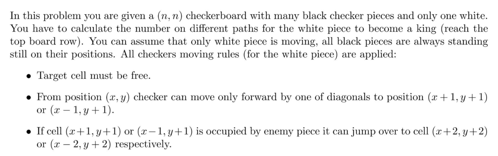
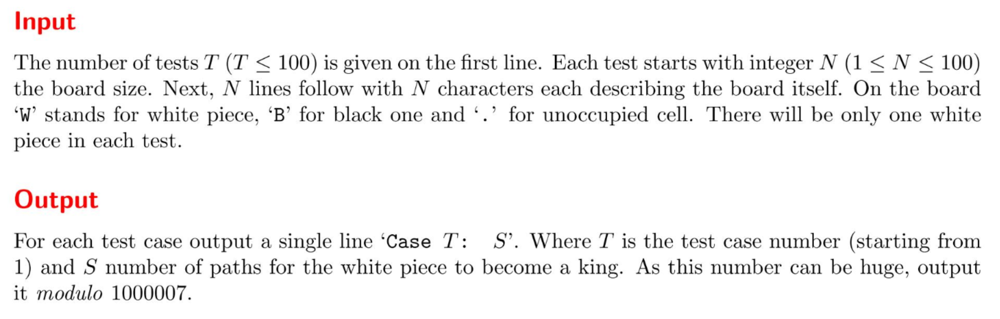
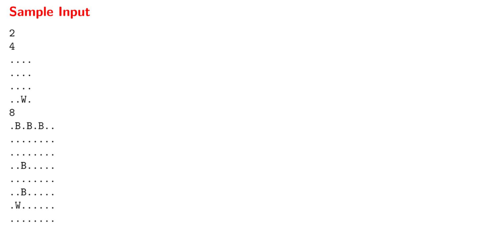
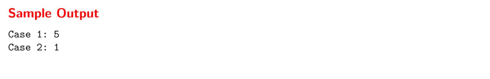
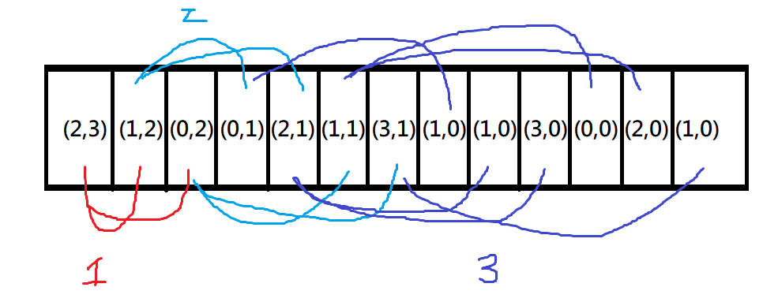

本程式是原創

# 題目

題目取自: CPE  22F4.UVa110957 (2022/10/18 考古題 第四題)

解法: [BFS](#BFS)、[DP](#DP)










題目大致在說，輸入一個二維陣列，字串一共有三個: `*、E、B`，玩家從`E`開始出發，從下往上走，走斜的((x-1, y-1) or (x+1, y-1))，走到最上面一共可以有幾種方法，如果右上或是左上遇到`E`，就跳過他((x-2, y-2) or (x+2, y-2))，如果到底或是又一個`E`，就不能往前

```
  x x x x x
y 0 1 2 . .
y 1
y 2
y .
y .
```


## BFS

> 使用廣度搜尋

速度較慢，遞迴的方法

```
* * * *
* * * *
* * * *
* * W *
```

W = (2,3) 一開始把起始點丟到queue中，然後讓他往上爬到0，最後y=0的有幾個，就是有幾個方法。




```c++
#include <iostream>
#include <string>
#include <queue>
using namespace std;
struct Pos{
	int x;
	int y;
};
int main(){
	int ca, size;
	string map[101];
	cin >> ca;
	for(int i = 0; i < ca; i++){
		cin >> size;
		queue< Pos > qu;
		Pos Wpos; 
		for(int y = 0; y < size; y++){
			cin >> map[y];
			for(int x = 0; x < map[x].size(); x++){
				if(map[y][x]=='W'){
					Wpos.x = x; Wpos.y = y;  // 找出輸入的W位置
				}
			}
			
		}
		int ways = 0;
		qu.push(Wpos);
		while(!qu.empty()){
			Pos pp = qu.front();  // previous position  前一個位置
			qu.pop();
			Pos np;  // now position  目前位置
			// cout << "x:" << pp.x << ",y:" << pp.y << endl;
			if(pp.x-1>=0 && pp.y-1>=0){  // 限制條件
				if(map[pp.y-1][pp.x-1] == '.'){
					np.x = pp.x-1; 
					np.y = pp.y-1;
					qu.push(np);
				}
				if(map[pp.y-1][pp.x-1] == 'B'){
					if(pp.x-2>=0 && pp.y-2>=0){ // 限制條件
						np.x = pp.x-2; 
						np.y = pp.y-2;
						qu.push(np);
					}
				}
			}
			if(pp.x+1<size && pp.y-1>=0){
				if(map[pp.y-1][pp.x+1] == '.'){
					np.x = pp.x+1; 
					np.y = pp.y-1;
					qu.push(np);
				}
				if(map[pp.y-1][pp.x+1] == 'B'){
					if(pp.x+2<size && pp.y-2>=0){ // 限制條件
						np.x = pp.x+2; 
						np.y = pp.y-2;
						qu.push(np);
					}
				}
			}
			if(ways > 1000007) ways %= 1000007;
			if(pp.y == 0) ways++;
		}
		
		cout << "Case " << i+1 << ": " << ways << endl;
	}
	return 0;
}
```


## DP

> 使用動態規劃

速度快很多，一開始就建立次數表格

```
* * * *
* * * *
* * * *
* * W *
```

把輸入字串轉成dp(使用二維int紀錄)的形式，先把上面設定成 1，其他設定成0，然後下面的節點等於斜角相加，只需要loop一次輸入，就可以建構好，只需要取`W`在的位置的dp值，就可以知道他有幾個方法。

```
step1.
1 1 1 1
0 0 0 0
0 0 0 0
0 0 0 0

step2.
1 1 1 1
1 2 2 1
2 3 3 2
3 5 5 3
```


```c
#include <iostream>
#include <string>
#include <queue>
using namespace std;
struct Pos{
	int x;
	int y;
};
int main(){
	int ca, size;
	string map[101];
	cin >> ca;
	for(int i = 0; i < ca; i++){
		cin >> size;
		long long int dp[101][101] = {0};
		Pos Wpos; 
		for(int x = 0; x < size; x++){
			cin >> map[x];
			for(int y = 0; y < map[x].size(); y++){
				if(map[x][y]=='W'){
					Wpos.x = x; Wpos.y = y;  // 找出輸入的W位置
				}
			}
		}
		for(int x = 0; x < size; x++){
			for(int y = 0; y < size; y++){
				if(x==0) dp[x][y] = 1;
				else{
					if(y-1>=0){  // 左上偵測
						if(map[x-1][y-1] == '.' || map[x-1][y-1] == 'W'){
							dp[x][y] += dp[x-1][y-1];	
						}
						else if(map[x-1][y-1] == 'B'){
							if(y-2>=0 && x-2>=0){
								if(map[x-2][y-2] == '.' || map[x-1][y-1] == 'W'){
									dp[x][y] += dp[x-2][y-2];
								}
							}		
						}
					}
					if(y+1<size){  // 右上偵測
						if(map[x-1][y+1] == '.' || map[x-1][y-1] == 'W'){
					 		dp[x][y] += dp[x-1][y+1];
					 	}
					 	else if(map[x-1][y+1] == 'B'){
					 		if(y+2<size && x-2>=0){
					 			if(map[x-2][y+2] == '.' || map[x-1][y-1] == 'W'){
					 				dp[x][y] += dp[x-2][y+2];
					 			}
					 		}
						}
					}
				}
				if(dp[x][y] > 1000007) dp[x][y] %= 1000007;
			}	
		}
		
		cout << "Case " << i+1 << ": " << dp[Wpos.x][Wpos.y] << endl;
	}
	return 0;
}
```

