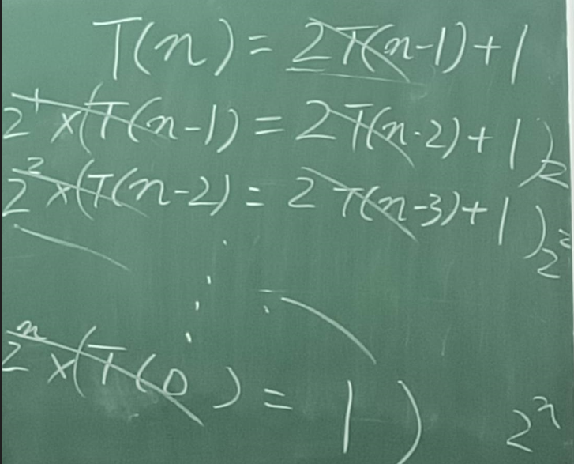

# 遞迴

> fibonacci.py: 費式數列

```python
from datetime import datetime

def fibonacci (n):
    if n < 0: raise
    if n == 0: return 0
    if n == 1: return 1
    return fibonacci(n - 1) + fibonacci(n - 2)


n = 35
startTime = datetime.now()
print(f'fibonacci({n})={fibonacci(n)}')
endTime = datetime.now()
seconds = endTime - startTime
print(f'time:{seconds}')
```


> gcd.py: 最大公因數

```python
def gcd(x, y):
	if x == 0: return y
	if y == 0: return x
	return gcd(y, x % y)

print('gcd(27, 45)=', gcd(27, 45))
```


> hanoi.py: 盒內塔

```python
def hanoi(n, curr, dest, rest):
    if n == 0: return
    hanoi(n - 1, curr, rest, dest)
    print(f"move {n} from {curr} to {dest}")
    hanoi(n - 1, rest, dest, curr)
    return

hanoi(3, "A", "B", "C")
```

使用對消法求得BigO = BigO(2^n) 1+2+4+8+...+2^n




> power2n.py

```python
def power2(n):
    if n == 0:
        return 1
    # return power2(n-1) + power2(n-1) 效能差的寫法，BigO(2^n)
	return 2*power2(n-1)  # 效能較好，BigO(2n)
print('power2(10)=', power2(10))
print('power2(100)=', power2(100))
```


> allCombination.py: 比較難的遞迴，需要用到巴斯卡三角形

```python
def combination(A, m): # 從 A 陣列中取出 m 個的所有可能性
	chooses = []
	c(A, len(A), m, chooses, m)

def c(A, n, k, chooses, m): # 從 A[0..n] 中選取 k 個補進 chooses，如果滿 m 個就印出
	if len(chooses)==m:
		print(chooses)
		return
	if n <= 0: return
	c(A,n-1,k,chooses,m) # C(n-1,k) // A[n-1] 沒取到

	chooses.append(A[n-1])
	c(A,n-1,k-1,chooses,m) # C(n-1,k-1) // A[n-1] 有取到
	del chooses[-1]

combination([1,2,3,4,5], 3)
```


下面的範例使用函數式編程加上遞迴，並使用皮亞諾系統完成相加的效果

```
0=0
1=S(0)
2=S(1)=SS(0)
...
n=S^n(0)
```


> add.py: 沒有迴圈的寫法

```python
def inc(n):return n+1
def dec(n):return n-1

def add(a, b):
    return b if a == 0 else add(dec(a), inc(b))
	# if a == 0:
    #     return b
    # else:
    #     add(dec(a), inc(b))

print('add(3,2)=', add(3,2))
```


> sqrt.py: 沒有迴圈的寫法，函數式編程

```python
def abs(x):
    return x if x >= 0 else -x

def square(x):
    return x*x

def sqrt_iter(guess, x):
    return guess if is_good_enough(guess, x) else sqrt_iter(improve(guess, x), x)

def improve(guess, x):  # x / guess = mid
    return average(guess, x / guess)

def average(x, y):  # high 和 low 的平均 mid
    return (x + y) / 2

def is_good_enough(guess, x):  # 判定條件
    return abs(square(guess) - x) < 0.001

def sqrt(x):
    return sqrt_iter(1, x)

print('sqrt(9)=', sqrt(9))
print('sqrt(100 + 37)=', sqrt(100 + 37))
print('sqrt(sqrt(2) + sqrt(3))=', sqrt(sqrt(2) + sqrt(3)))
print('square(sqrt(1000))=', square(sqrt(1000)))
```


# 函數式編程

裡面會大量使用 lamba (匿名函數)，裡面只能有一個if，不能使用assign

> fp.py: 使用python函數式編程最常用的功能

```python
from functools import reduce

a = range(1,5)
# x = x*x
print(list(map(lambda x:x*x, a)))  # [1, 4, 9, 16]  # 傳回不是陣列，所以要轉list()
# if x%2==1 return x
print(list(filter(lambda x:x%2==1, a)))  # [1, 3] 
print(reduce(lambda x,y:x+y, a))  # 10  # 1+2+3+4
```


> fp.py: 這個是自製的函數，不過沒有定義資料結構，所以有用到for迴圈

```python
def each(a, f):
    for x in a:
        f(x)

def map(a, f):
    r = []
    for x in a:
        r.append(f(x))
    return r

def filter(a, f):
    r = []
    for x in a:
        if f(x): r.append(x)
    return r

def reduce(a, f, init):
    r = init
    for x in a:
        r = f(r, x)
    return r

if __name__=="__main__":
    a = range(1,5)
    each(a, lambda x:print(x))  # 印出所有陣列元素
    each(a, lambda x:print(x) if x%2==0 else None)  # 印出偶數陣列元素
    print(map(a, lambda x:x*x))
    print(filter(a, lambda x:x%2==1))
    print(reduce(a, lambda x,y:x+y, 0))
```


> bubbleSort.py: 使用函數式編程，做泡沫排序

```python
import fp

def swap(a, i, j):
    a[i],a[j] = a[j], a[i]

def bubbleSort(a):
    n = len(a)
    fp.each(range(0,n), lambda i:
        fp.each(range(0,i), lambda j:
             swap(a,i,j) if a[j]>a[i] else None
        )
    )
    return a

a = [3,7,2,6,8,4]
bubbleSort(a)
print(a)
```


## python 

```python
lambda a,b: a > b
# 等於
def func01(a,b):
	return a > b

lambda x:x*x
# 等於
def func02(x):
	return x*x

lambda x,y:x+y
# 等於
def func03(x,y):
	return x+y

lambda x,print(x)
# 等於
def func03(x):
	return print(x)
```


```python
lambda a,b: b if a == 0 else add(a-1, b+1)
# 等於
def add(a, b):
    return b if a == 0 else add(a-1, b+1)
# 等於
def add(a, b):
    if a == 0: 
    	return b 
    else:
        add(a-1, b+1)
```


