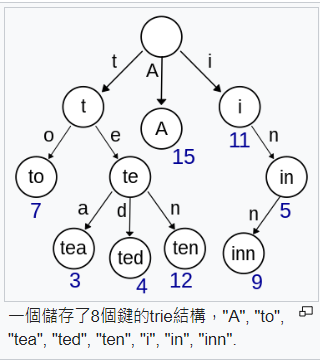

# 實用的爬蟲和資料庫處裡

## crawler

reference: https://gitlab.com/cccnqu111/alg/-/tree/master/C1-crawler

> download.py: 使用requests，上網抓網頁，並把網頁內容打印出來

```python
import requests

try:
    resp = requests.get('http://blog.castman.net/web-crawler-tutorial/ch1/connect.html')
except:
    resp = None

if resp and resp.status_code == 200: # 下載成功
    print('status_code=', resp.status_code)
    print(resp.text)
```


> download2.py: 把網站的資訊抓下來以後，使用最常使用的解析工具BeautifulSoap，對內容做解析

```python
import requests
from bs4 import BeautifulSoup

def main():
    try:
        resp = requests.get('http://blog.castman.net/web-crawler-tutorial/ch1/connect.html')
    except:
        resp = None

    if resp and resp.status_code == 200:
        print('status_code=', resp.status_code)
        # print(resp.text)
        soup = BeautifulSoup(resp.text, 'html.parser')
        # print(soup)
        try:
            h1 = soup.find('h1')  # 使用find尋找tag
        except:
            h1 = None
        if h1:
            print(soup.find('h1'))
            print(soup.find('h1').text)
            print(h1.text)
        try:
            h2 = soup.find('h2')
        except:
            h2 = None
        if h2:
            print(soup.find('h2').text)
        else:
            print('h2 tag not found!')

if __name__ == '__main__':
    main()
```


> pttHot.py: 抓取ppt熱門訊息的內容，需要使用特殊的方法，因為會有進入限制。把資訊存入json

```python
import requests
import time
import json
from bs4 import BeautifulSoup

PTT_URL = 'https://www.ptt.cc'

def get_web_page(url):
    resp = requests.get(url=url, cookies={'over18': '1'})  # 設置cookies，代表已滿18歲
    if resp.status_code != 200:
        print('Invalid url:', resp.url)
        return None
    else:
        return resp.text


def get_articles(dom, date):
    soup = BeautifulSoup(dom, 'html5lib')
    # Retrieve the link of previous page
    paging_div = soup.find('div', 'btn-group btn-group-paging')
    prev_url = paging_div.find_all('a')[1]['href']

    articles = []
    divs = soup.find_all('div', 'r-ent')
    for d in divs:
        # If post date matched:
        if d.find('div', 'date').text.strip() == date:
            # To retrieve the push count:
            push_count = 0
            push_str = d.find('div', 'nrec').text
            if push_str:
                try:
                    push_count = int(push_str)
                except ValueError:
                    # If transform failed, it might be '爆', 'X1', 'X2', etc.
                    if push_str == '爆':
                        push_count = 99
                    elif push_str.startswith('X'):
                        push_count = -10

            # To retrieve title and href of the article:
            if d.find('a'):
                href = d.find('a')['href']
                title = d.find('a').text
                author = d.find('div', 'author').text if d.find('div', 'author') else ''
                articles.append({
                    'title': title,
                    'href': href,
                    'push_count': push_count,
                    'author': author
                })

    return articles, prev_url


def get_author_ids(posts, pattern):
    ids = set()
    for post in posts:
        if pattern in post['author']:
            ids.add(post['author'])
    return ids


def main():
    current_page = get_web_page(PTT_URL + '/bbs/Gossiping/index.html')
    if current_page:
        # To keep all of today's articles.
        articles = []
        # Today's date, here we remove the 0 at the head to match the format of PTT date.
        # API doc for strftime: https://docs.python.org/3/library/datetime.html#strftime-strptime-behavior
        # API doc for lstrip: https://www.tutorialspoint.com/python/string_lstrip.htm
        today = time.strftime("%m/%d").lstrip('0')
        current_articles, prev_url = get_articles(current_page, today)

        while current_articles:
            articles += current_articles
            current_page = get_web_page(PTT_URL + prev_url)
            current_articles, prev_url = get_articles(current_page, today)

        print("Today's 5566:")
        print(get_author_ids(articles, '5566'))

        print('\nThere are ', len(articles), ' posts today.')
        threshold = 50
        print('Hot post(≥ %d push): ' % threshold)
        for article in articles:
            if int(article['push_count']) > threshold:
                print(article)
        # with as: https://openhome.cc/Gossip/Python/WithAs.html
        # json.dump: http://python3-cookbook.readthedocs.io/zh_CN/latest/c06/p02_read-write_json_data.html
        # json.dump: 把內容丟gossiping.json file裡面
        with open('gossiping.json', 'w', encoding='UTF-8') as file:
            json.dump(articles, file, indent=2, sort_keys=True, ensure_ascii=False)


if __name__ == '__main__':
    main()
```


> stockPrice.py: 抓取股票價錢，把資訊使用json打印出來

```python
import requests
import time

TWSE_URL = 'http://www.twse.com.tw/exchangeReport/STOCK_DAY?response=json'

def get_web_content(stock_id, current_date):
    resp = requests.get(TWSE_URL + '&date=' + current_date + '&stockNo=' + stock_id)
    if resp.status_code != 200:
        return None
    else:
        return resp.json()


def get_data(stock_id, current_date):
    info = list()
    resp = get_web_content(stock_id, current_date)
    if resp is None:
        return None
    else:
        if resp['data']:
            for data in resp['data']:
                record = {
                    '日期': data[0],
                    '開盤價': data[3],
                    '收盤價': data[6],
                    '成交筆數': data[8]
                }
                info.append(record)
        return info


def main():
    stock_id = '2330'
    current_date = time.strftime('%Y%m%d')
    current_year = time.strftime('%Y')
    current_month = time.strftime('%m')
    print('取得本月台積電 (2330) 的股價 %s %s...' % (current_year, current_month))
    get_data(stock_id, current_date)
    collected_info = get_data(stock_id, current_date)
    for info in collected_info:
        print(info)


if __name__ == '__main__':
    main()
```


> stockPriceCsv.py: 把股票價錢抓取後，存入CSV檔中，可以用來做數據搜集

```python
import requests
import time
import csv

TWSE_URL = 'http://www.twse.com.tw/exchangeReport/STOCK_DAY?response=json'

def get_web_content(stock_id, current_date):
    resp = requests.get(TWSE_URL + '&date=' + current_date + '&stockNo=' + stock_id)
    if resp.status_code != 200:
        return None
    else:
        return resp.json()


def get_data(stock_id, current_date):
    info = list()
    resp = get_web_content(stock_id, current_date)
    if resp is None:
        return None
    else:
        if resp['data']:
            for data in resp['data']:
                record = {
                    '日期': data[0],
                    '開盤價': data[3],
                    '收盤價': data[6],
                    '成交筆數': data[8]
                }
                info.append(record)
        return info


def main():
    stock_id = '2330'
    current_date = time.strftime('%Y%m%d')
    current_year = time.strftime('%Y')
    current_month = time.strftime('%m')
    print('取得本月台積電 (2330) 的股價 %s %s...' % (current_year, current_month))
    get_data(stock_id, current_date)
    collected_info = get_data(stock_id, current_date)
    # 寫入 CSV
    with open('stockThisMonth.csv', 'w', encoding='UTF-8', newline='') as file:
        writer = csv.writer(file)
        writer.writerow(('日期', '開盤價', '收盤價', '成交筆數'))
        for info in collected_info:
            print(info)
            writer.writerow([info['日期'], info['開盤價'], info['收盤價'], info['成交筆數'].replace(',', '')])

if __name__ == '__main__':
    main()
```


## SQL

sqlite可以使用 [SQLiteExpert personnal](https://www.sqliteexpert.com/download.html)做開發

> csvToSqlite.py: 把CVS檔轉換成sqlite

```python
import csv
import sqlite3
import os

def execute_sql(db, sql_cmd):
    cursor = db.cursor()
    cursor.execute(sql_cmd)
    db.commit()

STOCK_DB_FILE = 'stockPrice.db'
if os.path.isfile(STOCK_DB_FILE):
    os.remove(STOCK_DB_FILE)

db = sqlite3.connect(STOCK_DB_FILE)
execute_sql(db, f'CREATE TABLE stockPrice (日期 TEXT, 開盤價 INTEGER, 收盤價 INTEGER, 成交筆數 INTEGER)')

with open('stockThisMonth.csv', newline='', encoding="utf-8") as csvfile:
    reader = csv.DictReader(csvfile)
    print('日期', '開盤價','收盤價','成交筆數')
    for info in reader:
        print(info['日期'],info['開盤價'],info['收盤價'],info['成交筆數'])
        command = f'INSERT INTO stockPrice (日期, 開盤價, 收盤價, 成交筆數) VALUES("{info["日期"]}", {info["開盤價"]}, {info["收盤價"]}, {info["成交筆數"]})'
        print('command=', command)
        execute_sql(db, command)

db.close()
```


> sqlCli.py: 資料庫處裡客製化程式

```python
import sqlite3

db = sqlite3.connect('stockPrice.db1')
cursor = db.cursor()
while True:
    print('sql:', end='')
    cmd = input()
    if cmd == 'exit': break
    cursor.execute(cmd)
    rows = cursor.fetchall()
    for row in rows:
        print(row)
db.close()
```


## pytyhon視窗套件

QT是很好的視窗套件，但是太大了，所以這邊使用tkinter，python內建模型，比較簡單，排版陽春

> helloTK.py

```python
import tkinter as tk

root = tk.Tk()
message = tk.Label(root, text="Hello, World!")
message.pack()
root.mainloop()
```


> tableTK.py

```python
from tkinter import ttk
import tkinter as tk
import sqlite3

root = tk.Tk()

textSql = tk.Text(root, height=3, width=100)
textSql.pack()
textSql.insert(tk.END, "SELECT * FROM stockPrice")

button1 = tk.Button(text="查詢")
button1.pack(pady=10)

# 設定
tree = ttk.Treeview(root, column=("c1", "c2", "c3", "c4"), show='headings')
tree.column("#1", anchor=tk.CENTER)
tree.heading("#1", text="日期")
tree.column("#2", anchor=tk.CENTER)
tree.heading("#2", text="開盤")
tree.column("#3", anchor=tk.CENTER)
tree.heading("#3", text="收盤價")
tree.column("#4", anchor=tk.CENTER)
tree.heading("#4", text="成交筆數")
tree.pack()

root.mainloop()
```


> sqlTK.py: 連接資料庫，然後使用table視窗化呈現

```python
from tkinter import ttk
import tkinter as tk
import sqlite3

def View():
    for item in tree.get_children():
        tree.delete(item)
    con1 = sqlite3.connect("stockPrice.db1")
    cur1 = con1.cursor()
    cmd = sqltext.get(1.0, "end-1c")
    cur1.execute(cmd)
    rows = cur1.fetchall()
    for row in rows:
        # print(row) 
        tree.insert("", tk.END, values=row)        
    con1.close()

root = tk.Tk()

sqltext = tk.Text(root, height=3, width=100)
sqltext.pack()
sqltext.insert(tk.END, "SELECT * FROM stockPrice WHERE 收盤價 > 410 ORDER BY 收盤價 DESC")

buttonQuery = tk.Button(text="查詢", command=View)
buttonQuery.pack(pady=10)

tree = ttk.Treeview(root, column=("c1", "c2", "c3", "c4"), show='headings')
tree.column("#1", anchor=tk.CENTER)
tree.heading("#1", text="日期")
tree.column("#2", anchor=tk.CENTER)
tree.heading("#2", text="開盤")
tree.column("#3", anchor=tk.CENTER)
tree.heading("#3", text="收盤價")
tree.column("#4", anchor=tk.CENTER)
tree.heading("#4", text="成交筆數")
tree.pack()

root.mainloop()
```


> sqlTKChart.py:  連接資料庫，然後使用table視窗化呈現，使用matplotlib呈現資訊圖表

```python
from tkinter import ttk
import tkinter as tk
import sqlite3
import matplotlib.pyplot as plt
from datetime import datetime

def twDateToGlobal(twDate):
    year, month, date = twDate.split("/")
    return datetime(int(year), int(month), int(date))

def Chart():
    cmd = "SELECT * FROM stockPrice"
    cursor.execute(cmd)
    rows = cursor.fetchall()
    x = [twDateToGlobal(row[0]) for row in rows] # 日期
    y = [row[2] for row in rows] # 股價
    plt.plot_date(x, y, 'g')  # 折線圖
    plt.xticks(rotation=70)
    plt.show()

def View():
    global cursor
    for item in tree.get_children():
        tree.delete(item)
    cmd = sqltext.get(1.0, "end-1c")
    cursor.execute(cmd)
    rows = cursor.fetchall()
    for row in rows:
        # print(row) 
        tree.insert("", tk.END, values=row)        

db = sqlite3.connect("stockPrice.db1")
cursor = db.cursor()

root = tk.Tk()

sqltext = tk.Text(root, height=3, width=100)
sqltext.pack()
sqltext.insert(tk.END, "SELECT * FROM stockPrice")

buttonQuery = tk.Button(text="查詢", command=View)
buttonQuery.pack(pady=10)
buttonChart = tk.Button(text="股價圖", command=Chart)
buttonChart.pack(pady=10)

tree = ttk.Treeview(root, column=("c1", "c2", "c3", "c4"), show='headings')
tree.column("#1", anchor=tk.CENTER)
tree.heading("#1", text="日期")
tree.column("#2", anchor=tk.CENTER)
tree.heading("#2", text="開盤")
tree.column("#3", anchor=tk.CENTER)
tree.heading("#3", text="收盤價")
tree.column("#4", anchor=tk.CENTER)
tree.heading("#4", text="成交筆數")
tree.pack()

root.mainloop()

db.close()
```

可以使用PyInstaller把python打包成exe


# preprocess

## sort

> sort_search.py: 使用binary search尋找物件

```python
data = ["c", "a", "b", "e", "g", "d"]

data.sort()

print('data=', data)

def _bsearch(a, x, low, high):
    mid = (low+high)//2
    if a[mid] == x:
        return mid
    elif a[mid]<x:
        return _bsearch(a, x, mid+1, high)
    else:
        return _bsearch(a, x, low, mid-1)

def bsearch(a, x):
    return _bsearch(a, x, 0, len(a))

print('bsearch(data, "c")=', bsearch(data, "c"))
```


## index

> index: 使用index進行排序，每次加入新資料都要再跑一次

```python
data = ["c", "a", "b", "e", "g", "d"]
index = list(range(len(data)))  # 0~6

index.sort(key=lambda i:data[i])
print('idex=', index)
print('data[index]=', [data[i] for i in index])
```


## hash

> hash.py: 建立hash table，可以輕鬆新增資料

```python
data = ["c", "a", "b", "e", "g", "d"]
N = 17
hash_table = [None]*N  # 初始化hash table

for d in data:
    i = hash(d)%N  # hash是python的雜湊函數
    while hash_table[i] is not None: # 有碰撞的話就往後面一個放
        i = (i+1)%N
    hash_table[i] = d

print('hash_table=', hash_table)
```

O: 上限、omega: 下限、theta: 中限

效能比對

```
                            O                   Average
Hash                       O(n)                 O(1)         
index                      O(n)                 O(n)          
red-black tree             O(logn)              O(logn)          
```


## 文字處理

kmp: 建立失敗表

trie: 對整個文章建立一棵樹

> regexp.py: 正規表達式比對字串

```sh
(.*) 可以表達任何字串(.是指所有字元 *是指多個) 

\d 比對數字([0-9]) /w 比對字母
\s 比對空格字元 \s* 比對多個空格
. --> 所有字元 
+ --> 比對一次以上
* --> 比對零次以上
? --> 比對零次和一次
{x, y} --> 比對x~y次

字符串比對可以用"/(.*)" 表示根目錄位置


\符號 --> 如果符號有特殊涵意，可以用\取消他的特殊涵義，讓他變成可以比對的符號(\.)

正規表達式.exec(html) : 抓出裡面的的東西，傳回矩陣 [0] --> 全部， 
			[1] --> 第一個誇號裡的東西
```

```python
# https://docs.python.org/3/library/re.html
import re

s = "24.1632"
m = re.match(r"(\d+)\.(\d+)", s)
print('s=', s, 'groups=', m.groups())

s = "Malcolm Reynolds"
m = re.match(r"(?P<first_name>\w+) (?P<last_name>\w+)", s)  # 可以對參數取名字
print('s=', s, 'groups=', m.groups())  # m.group('first_name') 可以取到 Malcolm
```


> gzip: 檔案壓縮

```python
import gzip
import shutil
with open('file.txt', 'rb') as f_in:
    with gzip.open('file.txt.gz', 'wb') as f_out:
        shutil.copyfileobj(f_in, f_out)
```


> kmp.py: 快速字串搜尋法

```python
# from https://gist.github.com/m00nlight/daa6786cc503fde12a77
class KMP:
    def partial(self, pattern):
        """ Calculate partial match table: String -> [Int]"""
        ret = [0]
        
        for i in range(1, len(pattern)):
            j = ret[i - 1]
            while j > 0 and pattern[j] != pattern[i]:
                j = ret[j - 1]
            ret.append(j + 1 if pattern[j] == pattern[i] else j)
        return ret   ## 失敗函數
        
    def search(self, T, P):
        """ 
        KMP search main algorithm: String -> String -> [Int] 
        Return all the matching position of pattern string P in T
        """
        partial, ret, j = self.partial(P), [], 0
        
        for i in range(len(T)):
            while j > 0 and T[i] != P[j]:
                j = partial[j - 1]
            if T[i] == P[j]: j += 1
            if j == len(P): 
                ret.append(i - (j - 1))
                j = partial[j - 1]
            
        return ret

def test():
    p1 = "aa"
    t1 = "aaaaaaaa"

    kmp = KMP()
    assert(kmp.search(t1, p1) == [0, 1, 2, 3, 4, 5, 6])

    p2 = "abc"
    t2 = "abdabeabfabc"

    assert(kmp.search(t2, p2) == [9])

    p3 = "aab"
    t3 = "aaabaacbaab"

    assert(kmp.search(t3, p3) == [1, 8])

    p4 = "11"
    t4 = "111"
    assert(kmp.search(t4, p4) == [0, 1])

    print("all test pass")

test()
```


## trie

> trie.py: 使用很精簡的樹儲存文字

其他還有trie的進化版，像是: [Radix tree(可以有string的trie)](https://en.wikipedia.org/wiki/Radix_tree)、**Patricia tries(二分的trie)，http://ccckmit.wikidot.com/re:paper裡面有[使用Patricia tries做中文分詞](http://ccckmit.wdfiles.com/local--files/re%3Apaper/ChineseSegmentation.pdf)，可以使用很快地速度找到子字串**



```python
# from -- https://github.com/TheAlgorithms/Python/blob/master/data_structures/trie/trie.py
"""
A Trie/Prefix Tree is a kind of search tree used to provide quick lookup
of words/patterns in a set of words. A basic Trie however has O(n^2) space complexity
making it impractical in practice. It however provides O(max(search_string, length of
longest word)) lookup time making it an optimal approach when space is not an issue.
"""


class TrieNode:
    def __init__(self) -> None:
        self.nodes: dict[str, TrieNode] = dict()  # Mapping from char to TrieNode
        self.is_leaf = False  # 判斷有沒有子結點，用在刪除和顯示

    def insert_many(self, words: list[str]) -> None:
        """
        Inserts a list of words into the Trie
        :param words: list of string words
        :return: None
        """
        for word in words:
            self.insert(word)

    def insert(self, word: str) -> None:
        """
        Inserts a word into the Trie
        :param word: word to be inserted
        :return: None
        """
        curr = self
        for char in word:
            if char not in curr.nodes:
                curr.nodes[char] = TrieNode()
            curr = curr.nodes[char]
        curr.is_leaf = True

    def find(self, word: str) -> bool:
        """
        Tries to find word in a Trie
        :param word: word to look for
        :return: Returns True if word is found, False otherwise
        """
        curr = self
        for char in word:
            if char not in curr.nodes:
                return False
            curr = curr.nodes[char]
        return curr.is_leaf

    def delete(self, word: str) -> None:
        """
        Deletes a word in a Trie
        :param word: word to delete
        :return: None
        """

        def _delete(curr: TrieNode, word: str, index: int) -> bool:
            if index == len(word):
                # If word does not exist
                if not curr.is_leaf:
                    return False
                curr.is_leaf = False
                return len(curr.nodes) == 0
            char = word[index]
            char_node = curr.nodes.get(char)
            # If char not in current trie node
            if not char_node:
                return False
            # Flag to check if node can be deleted
            delete_curr = _delete(char_node, word, index + 1)
            if delete_curr:
                del curr.nodes[char]
                return len(curr.nodes) == 0
            return delete_curr

        _delete(self, word, 0)


def print_words(node: TrieNode, word: str) -> None:
    """
    Prints all the words in a Trie
    :param node: root node of Trie
    :param word: Word variable should be empty at start
    :return: None
    """
    if node.is_leaf:
        print(word, end=" ")

    for key, value in node.nodes.items():
        print_words(value, word + key)


def test_trie() -> bool:
    words = "banana bananas bandana band apple all beast".split()
    root = TrieNode()
    root.insert_many(words)
    # print_words(root, "")
    assert all(root.find(word) for word in words)
    assert root.find("banana")
    assert not root.find("bandanas")
    assert not root.find("apps")
    assert root.find("apple")
    assert root.find("all")
    root.delete("all")
    assert not root.find("all")
    root.delete("banana")
    assert not root.find("banana")
    assert root.find("bananas")
    return True


def print_results(msg: str, passes: bool) -> None:
    print(str(msg), "works!" if passes else "doesn't work :(")


def pytests() -> None:
    assert test_trie()


def main() -> None:
    """
    >>> pytests()
    """
    print_results("Testing trie functionality", test_trie())


if __name__ == "__main__":
    main()
```

