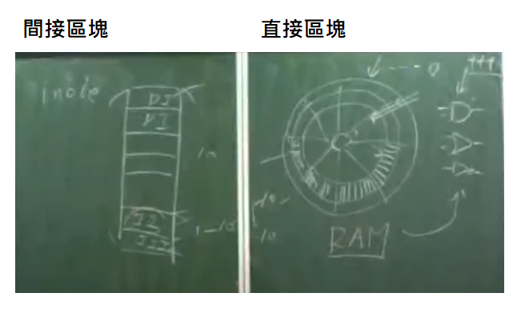

## P=NP

這個問題還沒有被解決


通常所說的[圖靈機](https://zh.wikipedia.org/wiki/图灵机)都是確定型圖靈機。**非確定型圖靈機**和[確定型圖靈機](https://zh.wikipedia.org/wiki/确定型图灵机)的不同之處在於，在計算的每一時刻，根據當前狀態和讀寫頭所讀的符號，機器存在多種狀態轉移方案，機器將任意地選擇其中一種方案繼續運作，直到最後停機為止。非確定型圖靈機範圍比確定型圖靈機還廣

P = O(n^k)  : 次方性問題 : 用確定型圖靈機可解的問題

E = O(2^n)  : 指數性問題

NP = O(n^k) : 用非確定圖靈機可解的問題


如果可以找到題目是落在 NP 卻沒有 在 P 裡面，就可以拿走 100萬美金


NP問題有很多，下面講一下NP-Complete(NP裡面最難的問題，基本所有NP都可以轉成這樣的形式)

* SAT(布林式可滿足問題)
* Integer Programming(整數規劃問題)


## fileSystem

直接區塊: 直接把資料存到RAM

間接區塊(inode): 把區塊代號填入RAM，真正資料存在區塊裡面




B-tree

現在磁碟一個區塊大概就4K、8K，所以我們可以讓一個區塊塞滿一個節點，讓效能提高

這個是使用間接區塊會用到的資料結構，可以把區塊代號存入RAM裡面


如果使用一般的紅黑樹存，對一個 2^30 的資料，磁碟就必須做30次的移動和讀取，而對一個區塊大小2048的B-tree，4次就可以讀取到了，如果資料有放快取裡面，又可以更快的讀取到資料


但是B-tree的新增修改和刪除超級難，需要參考別人的演算法，才能自己寫出來


雜湊表無法進行排序、比大小，所以不適合使用在這個地方


## index

資訊檢索

> invBuild.py: 建立檔案

```python
import invIndex as i2

docs = [
    'Search engine indexing is the collecting, parsing, and storing of data to facilitate fast and accurate information retrieval. Index design incorporates interdisciplinary concepts from linguistics, cognitive psychology, mathematics, informatics, and computer science. An alternate name for the process, in the context of search engines designed to find web pages on the Internet, is web indexing.',
    'In computer science, an inverted index (also referred to as a postings list, postings file, or inverted file) is a database index storing a mapping from content, such as words or numbers, to its locations in a table, or in a document or a set of documents (named in contrast to a forward index, which maps from documents to content). The purpose of an inverted index is to allow fast full-text searches, at a cost of increased processing when a document is added to the database. The inverted file may be the database file itself, rather than its index. It is the most popular data structure used in document retrieval systems,[1] used on a large scale for example in search engines. Additionally, several significant general-purpose mainframe-based database management systems have used inverted list architectures, including ADABAS, DATACOM/DB, and Model 204.',
    '倒排索引（英語：Inverted index），也常被稱為反向索引、置入檔案或反向檔案，是一種索引方法，被用來儲存在全文搜尋下某個單詞在一個文件或者一組文件中的儲存位置的對映。它是文件檢索系統中最常用的資料結構。',
    '資訊檢索（英語：Information Retrieval）是从信息资源集合获得与信息需求相关的信息资源的活动。搜索可以基于全文或其他基于内容的索引。'
]

invIndex = {}
i2.idxBuild(invIndex, docs)
i2.idxSave(invIndex)
```


> invindex.py: 搜尋檔案

```python
import re

PATH = './index'

def addIndex(invIndex, word, d):
    # print('add:', word, d)
    bucket = invIndex.get(word)
    if bucket:
        if not d in bucket:
            bucket.append(d)
    else:
        invIndex[word] = [d]

def idxBuild(invIndex, docs):
    for d in range(len(docs)):
        i = 0
        doc = docs[d]
        dlen = len(doc)
        while i<dlen:
            eword = re.compile("[a-zA-Z]+")  # 使用正規表達式使用
            m = eword.match(doc, i)
            word = None
            if m:
                word = m.group(0).lower()
                addIndex(invIndex, word, d)
                i+=len(word)
            else:
                cword = re.compile("[\u4e00-\u9fff]{1,3}") # https://stackoverflow.com/questions/2718196/find-all-chinese-text-in-a-string-using-python-and-regex  中文字的字區，抓取一到三個字
                m = cword.match(doc, i)
                if m:
                    word = m.group(0)
                    for wlen in range(1, len(word)+1):
                        addIndex(invIndex, word[0:wlen], d)
                i+=1

def idxSave(invIndex, path=PATH):
    # key 文字， hits 存檔陣列
    for key, hits in invIndex.items():
        # print(f'{key}:{hits}')
        with open(f'{path}/{key}', mode='ab') as f:
            f.write(bytearray(hits))
            #for hit in hits:
            #    f.write(hit.to_bytes(4, byteorder='big', signed=False))

def idxQuery(word, path=PATH):  # 開檔讀檔
    # print(f'idxQuery({word}):')
    with open(f'{path}/{word}', mode='rb') as f:
        hits = list(f.read())
        return hits
```


> invQuery: 測試檔案

```python
import invIndex as i2

print('idxQuery(索引)=', i2.idxQuery('索引'))
print('idxQuery(retrieval)=', i2.idxQuery('retrieval'))
```


## Reference

https://zh.wikipedia.org/zh-tw/B%E6%A0%91

https://zh.wikipedia.org/zh-tw/P/NP%E9%97%AE%E9%A2%98

https://zh.wikipedia.org/zh-tw/%E9%9D%9E%E7%A1%AE%E5%AE%9A%E5%9E%8B%E5%9B%BE%E7%81%B5%E6%9C%BA