# Math

以下內容全部都參考至[陳鍾誠](https://www.slideshare.net/ccckmit?utm_campaign=profiletracking&utm_medium=sssite&utm_source=ssslideview)教授的PPT: https://www.slideshare.net/ccckmit/ss-68579935

這邊德

歐式幾何有嚴謹的定義出數學，而希爾伯特也提出要嚴謹的定義出數學的結構，下面幾個就是基本的數學結構

* 群(group)、體(field)、環、模
* 向量、張量、場
* 拓樸學、分析學、希爾伯特空間


數學基礎: 集合、邏輯、函數(1個輸入只能有1個輸出)、關係、證明


數學基礎主要建立在 "集合" 上的 "邏輯" 系統，主要研究對象可以表示成 "函數" 或 "關係"，而這些體制需要建立在嚴格的 "證明" 上


數學系三大領域: 代數、幾何、分析(微積分)

1. 代數: 研究 "加減乘除" 這些運算的數學結構，可以使用文字描述結構

   ex: 代數學、線性代數、群論(RSA其實就算一種)、伽(ㄑ一ㄝˊ)羅瓦理論、數論

2. 幾何: 研究 "空間" 的結構，包含: 直的歐氏空間、彎的曲面空間(包含可微分的黎曼空間)，不容易使用文字描述

   ex: 歐氏幾何(使用圓規和直尺)、解析幾何(使用座標描述幾何)、非歐幾何、微分幾何(流形+拓樸學)

3. 分析: 研究 "連續函數"，特別是 "可微分的函數"，加入 "微分" 和 "積分" 這兩個重要運算

   ex: 分析學基礎、微積分(近代數學核心)、微分方程、實變函數、複變函數

在證明時，如果代數的方法無法證明，就可以使用幾何方法證明，反之也一樣


## 代數

研究 "加減乘除" 這些運算的數學結構

ex: 代數學、線性代數、群論、伽(ㄑ一ㄝˊ)羅瓦理論、數論


通常運作在 "數" 的上面，像是: N(整數)、Q(有理數)、R(實數)、C(複數) ...

討論的目標物體: 群(group)、體(field)、環(ring)、模(module)、代數(algebra)


> 代數特性

通常代數都會有以下幾個特性，下面會以加法舉例

* 封閉性: `a+b` 也是實數  [A和B是集合的元素，A和B做運算後，在集合裡面]
* 結合性: `(a+b)+c = a+(b+c)`  [加上誇號不影響運算]
* 單位元素: `a+0 = 0+a = a`  [A和某個值做運算後，A還是A]
* 反元素: `a+(-a) = (-a)+a = 0`  [在集合裡面某個元素和特定元素做運算後，會變成單位元素]
* 交換性: `a+b = b+a`  [A和B交換位置不影響運算值]


### group

代數特性會形成 "群論" 的結構 (群、交換群、半群、么半群 | 原群、擬群、么擬群 | 李群、廣群、拓樸群)

如果把 "群" 的概念數學化，可以使用一個集合 S 加上一個運算(。)表示成下面的形式

--> `G = (S, 。)`

群是單一運算，可以把上面幾個特性寫成下面的形式

* 封閉性: `(a。b) in S` 也是實數  [A和B是集合的元素，A和B做運算後，在集合裡面]
* 結合性: `(a。b)。c = a。(b。c)`  
* 單位元素: `a。e = e。a = a` 
* 反元素: `a。a^-1 = a^-1。a = 0`  
* 交換性: `a。b = b。a`

|                  | 封閉性 | 結合性 | 單位元素 | 反元素 | 交換性 |
| ---------------- | ------ | ------ | -------- | ------ | ------ |
| 群               | ✓      | ✓      | ✓        | ✓      | -      |
| 交換群(阿貝爾群) | ✓      | ✓      | ✓        | ✓      | ✓      |
| 半群             | ✓      | ✓      | ✗        | ✗      | -      |
| 么半群           | ✓      | ✓      | ✓        | ✗      | -      |
| 環群             | ✓      | ✗      | ✓        | ✓      | -      |
| ...              | ...    | ...    | ...      | ...    | ...    |


### field

體是有兩種運算的結構 ，下面使用 "實數" 、 "加法" 、 "乘法" 所形成的 體 當作範例講解

實數的加法`(R, +)` 和 實數的乘法(集合不含0)`(R-0, *)` 符合 交換群，而且滿足分配律，所以這種組合稱為 "體"

--> `F = (R, +, *)`

除了 "實數體 `(R, +, *)`" 之外，還有 "複數體 `(C, +, *)`" 跟 "有理數體 `(Q, +, *)`"


### ring

對 "整數" 而言，因為乘法反元素可能不會是整數，所以無法形成 "體"，所以對於這種有缺陷的體，就稱之為 "環"

"環" 是 "么半群" 的集合，而非 "群"，就像是 `(整數, 乘法)`

 `(Z, +, *)` 是環結構(整數環; 因為乘法反元素 1/a，/可能不是整數，不屬於Z)


### Module

線性代數有出現過的結構，是 "具有兩個集合和兩個運算的結構"，像是向量加上實數的運算，下面的形式就是一種模的結構

`M = (R, M, +, *)`

R (r, s) 是一個環 ，M (x, y)是交換群，滿足下面的條件，就是模

* 結合性: `r*(x+y) = r*x + r*y`、`(r+s)*x = r*x + s*x`

* 交換性: `(r*s)*x = r*(s*x)`

* 單位元素: `1*x = x`


"模" 把 常量、向量、加法；


### Algebra

代數結構符合下面的特性

* 右結合性: `(x+y)*z = x*z + y*z`
* 左結合性: `z*(x+y) = z*x + z*y`
* 常相容性:  `(ax) * (by) = (ab) (x * y)`

把矩陣的概念抽象化，變成雙線性映射 (A X A -> A)，所以矩陣就是代數結構


這些差不多就是代數的所有結構，就只有 偏序 (Lattice) 結構沒有提到而已


## 伽羅瓦理論

證明不可能用直尺和圓規 化圓為方，證明無法用直尺和圓規把立方體變一倍(倍立方體)，證明1元5次方程式無法用加減乘除算出來


## 分析

研究 "連續函數"，特別是 "可微分的函數"(沒有轉角)，加入 "微分" 和 "積分" 這兩個重要運算

ex: 分析學基礎、微積分、微分方程、實變函數、複變函數


微分和積分 ==> `f 微分後再積分 = f`  ==> 微積分基本定理

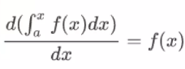


```
d/dx e^x = e^x  # e^x 是微積分的單位元素 !

(y)' = y
dy/dx = y
df(x)/dx = f(x)
```

> integration.py: 積分運算

```python
def integrate(f, a, b, h=0.001):
	area = 0
	x = a
	while x<b:
		area += f(x)*h
		x+=h
	return area

print(f'integrate(x**2, 0, 1)=', integrate(lambda x:x**2, 0, 1))
```


對於多個變數，可以使用 "偏微分" 和 "多重積分" 處裡

對於向量也有運算和積分

* 內積: 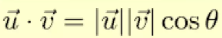
* 外積: 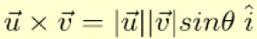
* 通量: 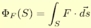
* 環量: 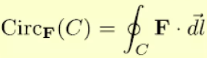


比向量更高階的運算

* 梯度: 
* 散度: 
* 旋度: 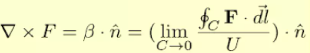


在高階的運算數學家們又有推導出很多定理

* 旋轉定理
* 散度定理


## 幾何

研究 "空間" 的結構，包含: 直的歐氏空間、彎的曲面空間(非歐幾何; 包含可微分的黎曼空間)

ex: 歐氏幾何、解析幾何、非歐幾何、微分幾何(流形+拓樸學)


### 歐式幾何

對應到牛頓的世界

探討 "剛硬的不可彎曲空間"，通常以直角座標系為基礎 (解析幾何)


### 非歐幾何

對應到愛因斯坦的相對論，空間會彎曲，在速度快或是太陽在旁邊的時候

探討 "有彎曲度的空間" ，像是 球面、雙曲面、或其他可以 微分的曲面(微分幾何)


### 拓樸學

在離散數學的圖論，就算是拓樸學的部分

研究連續空間的幾何學，不管可不可以微分都研究

裡面的圖形空間可以無限拉伸、壓縮或是扭曲，但是不可以撕開或挖破

* 同胚(Homeomorphism)

  兩個拓樸空間之間的函數稱作同胚，同胚形成了所有拓樸空間上的等價關係，咖啡杯和甜甜圈就是同胚的例子

* 同倫(Homotopy)

  兩個拓樸空間有路徑可以將雙方空間對應起來


物理或傳統幾何學中 "空間是由一堆點所形成的" : 一維空間(線)、二維空間(面)、三維空間(體)


但在數學上，空間變得更加抽象化(才能有更高維的空間)，數學裡 "空間是一群點加上鄰域概念所形成的" ，所以 `Space = Point + Neighbor` ==> `S = (P, N)`

在點和鄰域上加了一些 "拓樸性質" 的限制:

* 點 X 是自己鄰域 N 的成員
* 包含 X 鄰域 N 的空間 N+ 也是 X 的鄰域
* 兩個 X 鄰域 N1 與 N2 的交集 N 也是 X 的鄰域
* 某鄰域 N 包含 M，則 N 是 M 內所有點的鄰域


### 拓樸空間

拓樸空間 要求定義 "鄰域"

在拓樸空間中，有很多種區分方式，由 "分離公理" 所定義，主要的分別是根據 "點或是區域的分離" 而定，其中採用 "點點分離" 方式所定義的空間，稱作 Hausdorff 空間


### 流形

流行是介於拓樸和歐氏空間的結構，大範圍來看是彎的，但小範圍是平的

流形要求鄰域同胚於歐式空間 (鄰域看起來像是平面)

在 Hausdorff 空間 加上 "鄰域同胚於歐式空間" 的條件，就會變成 流形(Manifold)

n 維流形的任一點之鄰域，必須和 n 維歐氏空間同胚


像是球面的每個小區域都可以映射到歐氏平面，所以球面是個流形

可以拆成數個曲面的空間，基本上都是流形


物理學上的難題，通常都是在這種多維的流形上面


> 空間比較

想要研究拓樸跟流形需要具有 n 維的空間扭曲想像力，不然很難看懂特殊形狀

|          | 結構                           |
| -------- | ------------------------------ |
| 拓樸空間 | 柔軟                           |
| 歐式空間 | 堅硬                           |
| 流形     | 大範圍柔軟、小範圍堅硬，無法折 |


### 微分幾何

如果在流形中加上可以微分的條件，就成了流形微分，可以用來描述 "彎曲空間" 的理論，而這個就是微分幾何研究的領域。

```
C^1: 可微分一次的流形
C^2: 可微分兩次的流形
..................
C^n: 可n次微分的流形
C^∞: 可無限次微分的流形
C^0: 連續但不要求可微分的流形
```


> 度量空間(Metric Space)

* 在彎曲的空間中，還是有距離的概念(d(x, y))，不過需要使用 "測地線" 的距離，而非 "直線距離"，有距離度量的空間，稱作度量空間


> 完備度空間向量 (Complete Metric Space)

* 要求空間中 "沒有縫隙" 且 "不缺皮"
* 空間中的柯西序列(Cauchy sequence; 實數序列 `|Xm - Xn| < r (正實數 r > 0 且存在正整數N 使所有的整數 m,n >= N)`)都收斂在該空間中


> 向量空間 (Vector Space)

* 定義了"向量加法交換群" 與 "純量對象量之乘法" 的空間
* 具有 "代數" 中 "模" 結構的空間


> 內積空間 (Inner Product Space)

* 在向量空間中加上內積運算就成了內積空間


> 希爾伯特空間 (Hilbert Space)

* 有內積且完備的空間就是希爾伯特空間


> 賦範空間 (Norm Vector Space)

* 有範數的空間就稱為賦範空間

* 可以和向量 v 和自己內積 (v 。 v)， (v 。 v)的平方根就稱為範數 (Norm)

  

> 巴拿赫空間 (Banach space)

* 具有完備性值的賦範向量空間 (Complete Normed Vector Space)
* "沒有縫隙" 且 "不缺皮" 的賦範向量空間
* 空間完備表示柯西數列會收斂
* 向是 n 為實數空間 R^n，也就是 "歐幾里得空間"，具有完備性質的向量空間，滿足 "巴拿赫空間" 的條件


> 數學空間關係圖

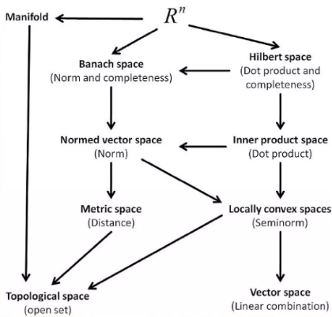


在幾何學裡，一個函數可以看作一個點，所以只要定義出函數與函數之間的距離就好

在希爾伯特空間中，三角函數可以被看成點，然後就可以用幾何的方式看待這些點，形成以函數為點的幾何學了

不同的 "空間特性" ，就會發展出不同的 "幾何學"，這些空間的分類方式往往與微分屬性，向是曲率有密切關聯

|            | 曲率       |
| ---------- | ---------- |
| 歐氏幾何   | 零曲率     |
| 球面幾何   | 正曲率     |
| 雙曲幾何   | 負曲率     |
| 不固定曲率 | 不固定曲率 |


### 相對論

"黎曼幾何" 和 "微分幾何" 和 "張量代數" 有密切的關係，可以從 "相對論" 中看到

在狹義相對論中，可以使域 "閔可夫斯基幾何" 來描述物理世界

在廣義相對論中，重力場方程式則是用 "張量" 來描述，這是因為 "張量" 就是用來描述 "曲面幾何" 的利器

相對論裡面有兩個重要的原理

1. 相對性原理

   物理定律在慣性座標轉換時維持相同的形式，我們可以找出在 "座標轉換" 下不變的物理公式，作為相對論誤裡學的公理系統，這種座標轉換系統，就是張量代數所討論的內容，張量代數還有討論雙線性形式的高維向量代數，張量和微分幾何之間有非常密切的關係

2. 等效原理

   廣義相對論說 "引力" 和 "加速度" 在物理定律上的效果相當，於是廣義相對論就不須找出一組 "讓引力與加速度同等" 的張量代數體系，於是 "幾何" 、 "流形" 、 "相對論" ，就密切的結合在一起了


# 傅立葉轉換

參考PPT: https://www.slideshare.net/ccckmit/ss-57088188

把 "特定頻率" 轉換成用 "多種固定波長、震幅的頻率"，可以用在過濾特定頻段的聲音和去除圖像細節、傅立葉轉換也有用在 JPEG 影像檔所採用的方式(取cos的實分)，把高頻的部分去除(細節)，讓圖像變得很小

傅立葉轉換是使用三角函數的組合，去逼近任何一個週期複函數


## 尤拉公式

> 泰勒展開式(麥克羅林及數): f(x)在a點展開的樣子

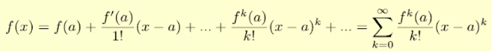


對尤拉公式的兩邊，各取泰勒展開式，就會得到下面的結果

```
e ^ ix = 1 + ix/1! - x^2/2! - ix^3/3! + ....

cos(x) = 1 - x^2/2! + x^4/4! + ...
sin(x) = x/1! - x^3/3! + x^5/5!

所以就可以得到尤拉公式: e ^ ix = cos(x) + isin(x)
```

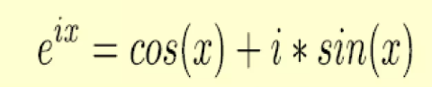


在極座標體系中，轉動很難進行描述，但使用了尤拉公式，可以把轉動變成移動 `f(x) = e ^ ix`，如下圖


```
f(x) = e ^ ix = cos(x) + isin(x)
--> f(x+φ) = e ^ i(x+φ) = cos(x+φ) + isin(x+φ) # 從轉動變成移動，可以很好的運用在描述波的位移
```


下面是波的描述(傅立葉級數)，使用Sin和Cos逼近，也可以寫成積分的形式，意義不變(就跟黎曼積分一樣)，不過加總比較偏離散，積分是連續的

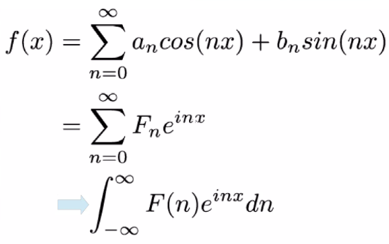


傅立葉轉換公式。正轉換(左), 負轉換(右)

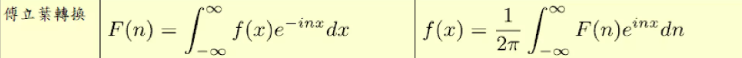


傅立葉轉換中，sin裡面的系數越大，就代表頻率越高


> fftguess.py

```python
# https://docs.scipy.org/doc/numpy/reference/generated/numpy.fft.fft.html
import random
import numpy as np
import matplotlib.pyplot as plt
np.set_printoptions(precision=4, suppress=True)
pi = np.pi

def fseries(f, a=-pi, b=pi, N=128):
    L = (b-a)/2.0
    t = np.arange(a, b, L/N)
    q = random.randint(0, N)
    print('random:q=', q)
    ft = f(q*t*pi/L)
    Fq = np.fft.fft(ft)/(2*N)
    # print('Fq=', Fq)
    # plt.plot(t,ft,label="f0t", color="green", linewidth=1)
    # plt.plot(t,Fq,label="F0q", color="blue", linewidth=1)
    # plt.show()
    return Fq

def guess(Fq):
    for i in range(len(Fq)):
        if abs(Fq[i]) > 0.01:
            return i
    return -1

Fq = fseries(np.cos, a=2*pi, b=10*pi, N=128)
q = guess(Fq)
print('guess:q=', q)
# fseries(np.cos, L=np.pi, N=128)
```


> dft_test.py

```python
from dft import *
import numpy as np

N = 200
# N = 8
t = np.arange(-pi, pi, pi/N)  # 取 -pi 到 pi 之間的 N 個點
q = 1
f = np.cos  # 使用cos當作轉換函數
ft = f(q*t)
Fq = dft(ft)  # 使用離散傅立葉轉換(慢速傅立葉轉換)
ft2 = idft(Fq)  # 傅立葉反轉換 還原
# print('ft=', ft)
# print('Fq=', Fq)  # Fq 裡面應該會只有一個有值，其他都非常接近0，因為是用cos
# print('ft2=', ft2)
np.testing.assert_array_almost_equal(ft, ft2)  # 確認兩個轉換過後會不會一樣，只要大致一樣就OK
```


> dft.py: 傅立葉轉換程式碼

```python
import numpy as np
from cmath import exp
from math import pi

def dft(f):  
    """
       慢速正傅立葉轉換，快速傅立葉轉換需要做更多處理，會在F[n]的地方做遞迴分解運算
       f 是一個陣列，取樣之後的每一個值
    """
    N = len(f)
    F = np.array([0+0j]*N)  # 創建傅立葉轉換想要得到的陣列
    for n in range(N): 
        for x in range(N):  
            F[n] += exp(-1j*2.*pi*x*n/N)*f[x]  # 傅立葉轉換公式
    return F

def idft(F):
    """
       慢速正傅立葉轉換，快速傅立葉轉換需要做更多處理，會在F[n]的地方做遞迴分解運算
       F 是經過正傅立葉轉換後的陣列
    """
    N = len(F)
    f = np.array([0+0j]*N)
    for x in range(N):
        for n in range(N):
            f[x] += exp(1j*2*pi*x*n/N)*F[n]  # 逆轉換可以看
        f[x] /= N
    return f
```

