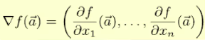

感知機是單層神經網路，可以做到AND、OR、NOT，但是無法做到XOR，因為單層神經網路只能處理一條線

```
(0, 1)    (1, 1)

(0, 0)    (1, 0)
無法把上面這四個座標數使用一條線切開
```


所以Hinton後來發明了反傳遞演算法，算是梯度下降法的快速版，讓神經網路可以變成多層，可以做到XOR

對於多層神經網路，我們很難以解釋，因為他是經過多個運算後的結果


如果要寫有關於神經網路的論文，可以參考下面的文章

[The Unreasonable Effectiveness of Recurrent Neural Networks (karpathy.github.io)](http://karpathy.github.io/2015/05/21/rnn-effectiveness/?fbclid=IwAR0IypMHrRXeby2O0KnsC1GkTE9_n7nBmM9QemYPhI_aASqGogcj-0NE59A)

[Hacker's guide to Neural Networks (karpathy.github.io)](http://karpathy.github.io/neuralnets/?fbclid=IwAR229GfWD95boQ8LweXhC7KY4jcQiYLGJ_25qdeG0NT1UGBD2nWpl3bPwjg)

[ConvNetJS: Deep Learning in your browser (stanford.edu)](https://cs.stanford.edu/people/karpathy/convnetjs/?fbclid=IwAR12D9kYXhY9QOGMW52-uiTFm2V2bW1Xg2eXjjoNjolS_GuiO31HTQpVrbo)

[language_understanding_paper.pdf (openai.com)](https://cdn.openai.com/research-covers/language-unsupervised/language_understanding_paper.pdf?fbclid=IwAR3jU0yQRe1N5kEoKmTrzCCAUuiENnuZhjugP2F3uv8pXkJrtqWjg7cmi_M)

[Language Models are Unsupervised Multitask Learners (d4mucfpksywv.cloudfront.net)](https://d4mucfpksywv.cloudfront.net/better-language-models/language_models_are_unsupervised_multitask_learners.pdf?fbclid=IwAR3fP7rkyu0ipNWdCAMmhg5N0_VGbTkp8oLv0CAFcl-muUcvwXyyNuQLljE)

[2005.14165.pdf (arxiv.org)](https://arxiv.org/pdf/2005.14165.pdf?fbclid=IwAR00pCPmAJd1g2dCfbaNhaq9HrpbbSSxp3RVPFIqeb3GGTqZdt_RZDBZhYI)

[Summary of the tasks (huggingface.co)](https://huggingface.co/docs/transformers/task_summary?fbclid=IwAR1tfcKL2AXimKVyJnTOtEGlow2PP8dwA3mlcpCwdj0isa2bRI93VNcsl7c)

[Dive into Deep Learning — Dive into Deep Learning 1.0.0-alpha1.post0 documentation (d2l.ai)](https://d2l.ai/?fbclid=IwAR3DHIiw7rEI98HUTSnML36i0vznTmKTj4tU90YNWhJ1KteJLUcPaxTw_Yw)


卷積層

conv : 遮罩，梯度下降

relu : 切，圖片低於某個程度就切掉

pool: 縮小

softmax: 把最明顯的那個當作答案，讓出來的數可以輕易地做反傳遞運算

想要學習新的人工智慧技術，可以看: https://www.youtube.com/@HungyiLeeNTU/videos


# gradient


> diff.py: 單變數微分

```python
def f(x):
    # return x*x
    return x**3

dx = 0.001

def diff(f, x):  # 微分定義
    df = f(x+dx)-f(x)   
    return df/dx

print('diff(f,2)=', diff(f, 2))
```


> vecGradient.py: 多變數微分

梯度: 

a是個向量，對每個向量做微分

```
# 對 x 的 偏微分
δf(x, y) / δx = lim(h->0) (f(x+h, y)-f(x, y)) / h

# 對 y 的 偏微分
δf(x, y) / δy = lim(h->0) (f(x, y+h)-f(x, y)) / h
```

梯度是一個向量， 如果全部為0，就代表是最低點

```python
step = 0.01

# 我們想找函數 f 的最低點
def f(p):
    [x,y] = p
    return x * x + y * y

# df(f, p, k) 為函數 f 對變數 k 的偏微分: df / dp[k]
# 例如在上述 f 範例中 k=0, df/dx, k=1, df/dy
def df(f, p, k):
    p1 = p.copy()
    p1[k] += step
    return (f(p1) - f(p)) / step

# 函數 f 在點 p 上的梯度
def grad(f, p):
    gp = p.copy()
    for k in range(len(p)):
        gp[k] = df(f, p, k)
    return gp

[x,y] = [1,3]
print('x=', x, 'y=', y)
print('df(f(x,y), 0) = ', df(f, [x, y], 0))  # 對第一維做微分  (x^2)'*1 = 2
print('df(f(x,y), 1) = ', df(f, [x, y], 1))  # 對第二維做為分  (y^2)'*3 = 6
print('grad(f)=', grad(f, [x,y]))  # 梯度  (2, 6)
```


> gd1.py

梯度下降法是機器學習的基本方法，一定會停到一個相對最低點S


```python
import numpy as np
from numpy.linalg import norm

# 函數 f 對變數 k 的偏微分: df / dk
def df(f, p, k, step=0.01):
    p1 = p.copy()
    p1[k] = p[k]+step
    return (f(p1) - f(p)) / step

# 函數 f 在點 p 上的梯度
def grad(f, p, step=0.01):
    gp = p.copy()
    for k in range(len(p)):
        gp[k] = df(f, p, k, step)
    return gp

# 使用梯度下降法尋找函數最低點
def gradientDescendent(f, p0, step=0.01):
    p = p0.copy()
    i = 0
    while (True):
        i += 1
        fp = f(p)
        gp = grad(f, p) # 計算梯度 gp
        glen = norm(gp) # norm = 梯度的長度 (步伐大小)
        print('{:d}:p={:s} f(p)={:.3f} gp={:s} glen={:.5f}'.format(i, str(p), fp, str(gp), glen))
        if glen < 0.00001:  # 如果步伐已經很小了，那麼就停止吧！
            break
        gstep = np.multiply(gp, -1*step) # gstep = 逆梯度方向的一小步
        p +=  gstep # 向 gstep 方向走一小步
    return p # 傳回最低點！

```


## transform

RNN -> LSTM -> transform

RNN: 可以記錄前幾次的回答

LSTM: 具有長短期記憶

transform: 每一個位置都有權重，有注意力機制

克漏字填空(BERT)、預測下一個字詞


通常模型訓練完，存的東西是權重，在預測時，就透過算出來最好的權重下去做對比，就可以得到輸出結果