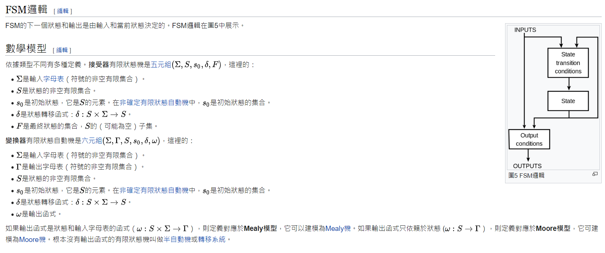

希爾伯特

所有的定理都是恆真式(x or x' = 1; 一定為真)

所有的布林恆真式是可數無限

羅素悖論: 矛盾

````sh
A = {x|x∉x}  # 羅素悖論  A ∈ A 則 A ∉ A，A ∉ A 則 A ∈ A
A = {x∉x}
-------------------------------------------
A ∈ A
ex: 
--> A = {1,2,A}
--> A = {1,2,x}
--> x = {1,2,x}
--> A = {x∈x} 
--> A ∉ A
-------------------------------------------
A ∉ A
ex:
--> A = {1,2,3}
--> x = {1,2,3}
--> A = {x∉x} 
--> A = {A} 
--> A ∈ A
-------------------------------------------
A = {A}  == A = {x∉x}
B = {1,2,3}  # B ∉ B
C = {1,2,B}  # C ∉ C
D = {1,2,D}  # D ∈ D
````


有理數是可數的，可以使用二維陣列表示(對角證法)。

實數不可數，不可數無限


哥德爾不完備定理 程式碼 證明

```c
function Proveable(str)
  if (str is a theorem) 
    return 1;           
  else                  
    return 0;           
end

isTheorem(∃s -Provable(s) & -Provable(-s))  // 一定為 false
```


## 停止問題

圖靈使用對角證法，證明在對角線上某一點，停機問題會出現矛盾的現象

> halt.py: 使用一個function，判斷另一個function會不會停

```python
def h(f, input):  # 判斷f會不會停止，當一個程式碼結束，返回True
    f(input)
    return True

def f1(n):
    return n * n

def f2(n):
    s = 0
    for _ in range(n):
        for _ in range(n):
            for _ in range(n):
                for _ in range(n):
                    s = s+1


print('h(f1,3)=', h(f1, 3))  # True
print('h(f2,1000)=', h(f2, 1000))  #
```


> isHalt.py: 可以寫一個函數，讓判斷另一個程式會不會停的函數判斷錯誤

```python
def H (procedure, Input):
    # 這里的H函數有兩種返回值，會停(1) 或 不會停(0)
    # ... 不管你怎麼實作，假如你真的做出來了
    pass

# 那麼我們可以呼叫 H 來寫個函數，讓你的 H 永遠判斷錯誤。
def U (P) :
    if H(P, P) == 1: # 如果會停
        while (True): pass # 那麼就不停
    else: # else 不會停
        return 1 # 那麼就停

# H(U, U) = ?

'''
case 1:
  H(U, U) = 1 代表 H 判斷 U(U) 會停，
              但此時會進入 while 無窮迴圈而不停，
              所以 H 判斷錯誤。

case 2:
  H(U, U) = 0 代表 H 判斷 U(U) 不會停，
              但此時會進入 return 而停掉，
              所以 H 又判斷錯誤。

'''
```


## grammer


```
E = T [+-*/] E
T = [0-9] | ∈ E
3+(5*8)
```


[Chomsky hierarchy](https://en.wikipedia.org/wiki/Chomsky_hierarchy): 規範語言的形式理論，有多種類型，下面會使用python模擬語法生成


> anbm.py: type0，是正規語法描述的方式，會產生n次a, m次b

```
import grammar

G = {
    "S":["A"],
    "A":["aA", "aA", "aA", "B"],
    "B":["bB", "bB", "bB", "b"]
}

grammar.gen(G)
```


> anbn.py: type2，不是正規語法，但會產生 n 次 a和b

```python
import grammar

G = {
    "S":["aSb","aSb","aSb","ab"] # 產生 anbn
}

grammar.gen(G)
```


> anbncn.py: type1，輸出的ABC字數都一樣

```python
import grammar

G = {
    "S":["aBC","aSBC","aSBC","aSBC"], # 產生 anBnCn
    "CB":["CZ"], # CB=>CZ=>WZ=>WC=>BC 導致 C 和 B 交換了?
    "CZ":["WZ"],
    "WZ":["WC"],
    "WC":["BC"],
    "aB":["ab"], # 換成小寫
    "bB":["bb"],
    "bC":["bc"],
    "cC":["cc"]
}

grammar.gen(G)
```


> grammer.py: 產生所有語言

```python
from random import *

def gen(G):  # 接收字典
    lefts = list(G.keys())
    rule = "S"
    while True:
        for left in lefts:
            i = rule.find(left)
            if i != -1:
                rights = G[left]
                # right = choice(rights)
                ri = randrange(0, len(rights)); right = rights[ri]
                rule = rule[0:i]+right+rule[i+len(left):]
                print(rule)
                if rule.islower(): return rule
                break
```


編譯器的描述通常是使用type1，正規表達式使用type3


> an.py: finiteStateMachine會辨認程式的狀態

```python
from finiteStateMachine import FiniteStateMachine

fsm = FiniteStateMachine('s0', ['s0'], {
    's0,a':'s0'
})
print(fsm)
print('aaa:', fsm.accept('aaa'))  # True
print('aab:', fsm.accept('aab'))  # False
print('aaaaaaa:', fsm.accept('aaaaaaa'))  # True
```


> anbm.py

```python
# 參考 https://zh.wikipedia.org/wiki/%E6%9C%89%E9%99%90%E7%8A%B6%E6%80%81%E6%9C%BA#/media/File:DFAexample.svg
from finiteStateMachine import FiniteStateMachine

fsm = FiniteStateMachine('s1', ['s2'], {
    's1,a':'s1',
    's1,b':'s2',
    's2,b':'s2',
})
print(fsm)
print('a:', fsm.accept('a'))
print('aab:', fsm.accept('aab'))
print('aabaa:', fsm.accept('aabaa'))
print('aabbb:', fsm.accept('aabbb'))
```


> even0.py: [有限狀態機](https://zh.wikipedia.org/zh-tw/%E6%9C%89%E9%99%90%E7%8A%B6%E6%80%81%E6%9C%BA)，有各種起始狀態，最後會轉為最終狀態，這邊是寫接收器



```python
# 參考 https://zh.wikipedia.org/wiki/%E6%9C%89%E9%99%90%E7%8A%B6%E6%80%81%E6%9C%BA#/media/File:DFAexample.svg
from finiteStateMachine import FiniteStateMachine

fsm = FiniteStateMachine('s1', ['s1'], {
    's1,0':'s2',
    's1,1':'s1',
    's2,0':'s1',
    's2,1':'s2'
})
print(fsm)
print('010:', fsm.accept('010'))
print('101:', fsm.accept('101'))
print('10100:', fsm.accept('10100'))
print('1010010:', fsm.accept('1010010'))
```


> finiteStateMachine.py: 判斷程式的狀態

```python
import json

class FiniteStateMachine:
    def __init__(self, start, finals, actionMap):
        self.actionMap = actionMap
        self.start = start
        self.finals = finals
    def accept(self, s):
        state = self.start
        i = 0
        while True:
            if i >= len(s): break
            state = self.actionMap.get(f'{state},{s[i]}')
            if state is None: return False
            i += 1
        return state in self.finals
    def __str__(self):
        return json.dumps({'start':self.start,'finals':self.finals,'actionMap':self.actionMap}, indent=2)
```


## 圖靈機

[圖靈機](https://zh.wikipedia.org/zh-tw/%E5%9B%BE%E7%81%B5%E6%9C%BA)

> TuringMachine.py: 辨識 anbncn 的圖靈機

```python
# https://zh.wikipedia.org/wiki/%E5%9B%BE%E7%81%B5%E6%9C%BA
# https://www.cs.odu.edu/~zeil/cs390/latest/Public/turing-jflap/index.html  # 重要圖靈機概念
class TuringMachine:
    def __init__(self, states, ichars, ochars, actionMap, start, accepts, rejects):
        self.states = states  # 目前狀態
        self.ichars = ichars
        self.ochars = ochars
        self.actionMap = actionMap  # 狀態轉移表
        self.start = start   # 起始狀態
        self.accepts = accepts  # 接收狀態
        self.rejects = rejects

    def action(self, state, ichar):
        line = self.actionMap.get(f'{state},{ichar}')
        if line == None: return None
        return line.split(',')

    # 參考 -- https://zh.wikipedia.org/wiki/%E5%9B%BE%E7%81%B5%E6%9C%BA#%E5%9B%BE%E7%81%B5%E6%9C%BA%E7%9A%84%E6%AD%A3%E5%BC%8F%E5%AE%9A%E4%B9%89
    def run(self, tape):
        self.tape = list(tape+'________') # 开始的时候将输入符号串，其他格子保持空白
        state = self.start # 機器一開始處於起始狀態
        i = 0 # 读写头指向第0号格子
        while True:
            ichar = self.tape[i]
            acts = self.action(state, ichar)
            if acts == None: return False
            state, ochar, move = acts # 執行動作
            self.tape[i] = ochar # 改寫這一格符號
            if move == 'L':
                if i > 0: i -= 1 # 向左移動 (但不能越過磁帶開頭)
            elif move == 'R': i += 1 # 向右移動
            elif move == '-': pass # 不移動
            else: raise Exception(f'move = {move} not allowed!')
            if state in self.accepts:
                return True
            if state in self.rejects:
                return False

if __name__=="__main__":
    # Construct a TM for the language L = {0n1n2n} where n≥1
    # https://www.cs.odu.edu/~zeil/cs390/latest/Public/turing-jflap/index.html
    # 3.1 $0^n1^n2^n$ 改為 anbncn, 0=a,1=b,2=c,epsilon=_
    tm = TuringMachine(
        ['0','1','2','3','4','5'],
        ['a','b','c'],
        ['a','b','c','X','_'],
        {
            '0,a':'1,_,R',
            '1,a':'1,a,R',
            '1,x':'1,x,R',
            '1,b':'2,x,R',
            '2,x':'2,x,R',
            '2,b':'2,b,R',
            '2,c':'5,x,L',
            '5,x':'5,x,L',
            '5,a':'5,a,L',
            '5,b':'5,b,L',
            '5,_':'0,_,R',
            '0,x':'4,x,R',
            '0,_':'3,_,L',
            '4,x':'4,x,R',
            '4,_':'3,_,L',
        },
        '0',
        ['3'],
        []
        )

    print(':', tm.run(''))  
    print('ab:', tm.run('ab'))  # 
    print('abtt:', tm.run('abtt')) 
    print('abc:', tm.run('abc'))
    print('aabbc:', tm.run('aabbc'))
    print('aabbcc:', tm.run('aabbcc'))
```

