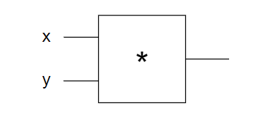
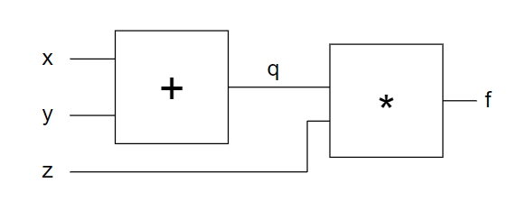
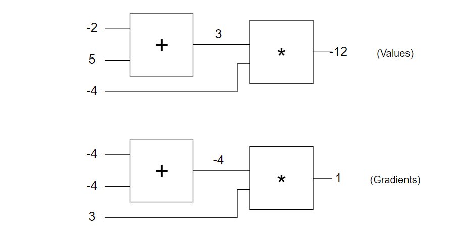

所有程式碼都是由: http://karpathy.github.io/neuralnets/?fbclid=IwAR229GfWD95boQ8LweXhC7KY4jcQiYLGJ_25qdeG0NT1UGBD2nWpl3bPwjg，經過修改而產出(裡面寫JavaScript我改成python)，本文使用的圖片也是從這裡面獲得的，裡面有添加上個人中文心得註解，還有證明部分數學偏微分(sigmoid)


# Single Gate in the Circuit

我們先定義一個人工智慧節點，可以看到如果`x = -2、y = 3`那輸出就會是 `-6`，我們現在想要找到有其他的x和y可以讓輸出會 `>-6`，所以就有了以下幾種方法[亂數搜尋](#Random-Local-Search)、[梯度運算](Numerical-Gradient)、


$$
f(x,y) = x y
$$


```python
def forwardMultiplyGate(x, y):
    return x * y

x = -2
y = 3
forwardMultiplyGate(x, y)  # -6
```


## Random Local Search

亂數搜尋，`random.random()`會產生`0~1`之間的隨機小數，使用100次隨機運算，找到更好的x和y

```python
# Random Local Search
tweak_amount = 0.01  # 調整數
best_out = -10000000000000  # -Infinity
print(forwardMultiplyGate(x, y))
best_x = x; best_y = y
for k in range(100):
    x_try = x + tweak_amount * (random.random() * 2 - 1)  # 調整一點x
    y_try = y + tweak_amount * (random.random() * 2 - 1)  # 調整一點y
    out = forwardMultiplyGate(x_try, y_try)
    if out > best_out:
        best_out = out
        best_x = x_try; best_y = y_try
print(best_out)  # -5.95
```


## Numerical Gradient

使用梯度法(梯度就是全部的偏微分加在一起，下面的公式就是對x做偏微分)，找到目前點的梯度，然後沿著梯度方向走，這個範例只有x和y，所以這個範例的梯度就是[x_derivative, y_derivative]


$$
\frac{\partial f(x,y)}{\partial x} = \frac{f(x+h,y) - f(x,y)}{h}
$$

```python
# Numerical Gradient
out = forwardMultiplyGate(x, y)  # 6
h = 0.0001
xph = x + h
out2 = forwardMultiplyGate(xph, y)  # -5.9997
x_derivative = (out2 - out) / h  # 對 x 做偏微分  3.00000000000189

yph = y + h
out3 = forwardMultiplyGate(x, yph)  # -6.0002
y_derivative = (out3 - out) / h  # 對 y 做偏微分  -2.0000000000042206

# gradient is just made up of the derivatives of all the inputs concatenated in a vector
step_size = 0.01
x = x + step_size * x_derivative  # 乘上梯度方向
y = y + step_size * y_derivative  # 乘上梯度方向
out_new = forwardMultiplyGate(x, y)  # -5.87059999999986
# 梯度法(-5.87)比起前面的random效果好的多
```


## Analytic Gradient

上一個做法還是有點不太好，因為要調整每個獨立的輸入，對於今天有好幾百萬甚至上億節點的運算，會花費很多效能，所以我們把下面這個公式帶入到偏微分的公式中。


$$
f(x,y) = x y
$$


就可以得出下方公式的結論: x 的偏為分為 y


$$
\frac{\partial f(x,y)}{\partial x} = \frac{f(x+h,y) - f(x,y)}{h} = \frac{(x+h)y - xy}{h} = \frac{xy + hy - xy}{h} = \frac{hy}{h} = y
$$


這種方法可以讓x和y計算偏微分時，減少很多運算，提升程式效能


```python
# Analytic Gradient
out = forwardMultiplyGate(x,y)
x_gradient = y  # 可以由上面的公式推導出來
y_gradient = x

step_size = 0.01
x += step_size * x_gradient
y += step_size * y_gradient
out_new = forwardMultiplyGate(x, y)  # -5.8706
```


# Circuits with Multiple Gates

當我們的節點變成多個(如下圖)，我們一樣要找輸出比較大的值



寫成公式如下
$$
\frac{\partial f(q,z)}{\partial x} = \frac{\partial q(x,y)}{\partial x} \frac{\partial f(q,z)}{\partial q}
$$
程式碼可以寫成下面的形式

```python
def forwardMultiplyGate(a, b):
    return a * b


def forwardAddGate(a, b):
    return a + b


def forwardCircuit(x, y, z):
    q = forwardAddGate(x, y)
    f = forwardMultiplyGate(q, z)
    return f


x = -2
y = 5
z = -4
forwardCircuit(x, y, z)  # -12
```


可以由[上面推導](#Analytic-Gradient)的，在`f(q,z) = q*z`的情況下，就會有下方的公式出現


$$
f(q,z) = q z \hspace{0.5in} \implies \hspace{0.5in} \frac{\partial f(q,z)}{\partial q} = z, \hspace{1in} \frac{\partial f(q,z)}{\partial z} = q
$$


我們也可以使用重複的做法，最後會得到在`f(x,y) = x+y`的情況下，偏微分會為1


$$
\frac{\partial f(x,y)}{\partial x} = \frac{f(x+h,y) - f(x,y)}{h} = \frac{(x+h+y) - (x+y)}{h} =  \frac{h}{h} = 1
$$

$$
q(x,y) = x + y \hspace{0.5in} \implies \hspace{0.5in} \frac{\partial q(x,y)}{\partial x} = 1, \hspace{1in} \frac{\partial q(x,y)}{\partial y} = 1
$$


可以得到下面的程式碼，這種方法稱作 Backpropagation

```python
# Backpropagation
q = forwardAddGate(x, y)
f = forwardMultiplyGate(q, z)

derivative_f_wrt_z = q  # 3
derivative_f_wrt_q = z  # -4

derivative_q_wrt_x = 1.0
derivative_q_wrt_y = 1.0

# chain rule，可以由上面的公式推導，求得x的偏微分和y的偏微分
derivative_f_wrt_x = derivative_q_wrt_x * derivative_f_wrt_q  # 4
derivative_f_wrt_y = derivative_q_wrt_y * derivative_f_wrt_q  # -4

# final gradient [-4, -4, 3]  # 對每個輸入(x, y, z)做偏微分的向量
gradient_f_wrt_xyz = [derivative_f_wrt_x, derivative_f_wrt_y, derivative_f_wrt_z]

step_size = 0.01
x = x + step_size * derivative_f_wrt_x  # -2.04
y = y + step_size * derivative_f_wrt_y  # 4.96
z = z + step_size * derivative_f_wrt_z  # -3.97

q = forwardAddGate(x, y)  # 2.92
f = forwardMultiplyGate(q, z)  # -11.5924
```

可以得到下面的圖，上面是節點運算，下面是節點梯度的運算



我們可以使用Numerical Gradient 做確認，看看上面使用Backpropagation的運算正不正確，當然結果是一樣的 `[-4, -4, 3]`

```python
# numerical gradient check
h = 0.0001;
x_derivative = (forwardCircuit(x+h,y,z) - forwardCircuit(x,y,z)) / h; # -4
y_derivative = (forwardCircuit(x,y+h,z) - forwardCircuit(x,y,z)) / h; # -4
z_derivative = (forwardCircuit(x,y,z+h) - forwardCircuit(x,y,z)) / h; # 3
```


# Single Neuron

接下來是單一神經元的運算，這裡面的數學就複雜的多，我們一樣要使用前面的Backpropagation概念，寫出程式碼，包含forward與backward，我認為forward主要代表填入運算式，然後backward就是根據目前運算的性質，寫出Analytic Gradient的公式，達到減少運算量的功效


$$
f(x,y,a,b,c) = \sigma(ax + by + c)
$$


 σ(x) is the *sigmoid* function


$$
\sigma(x) = \frac{1}{1 + e^{-x}}
$$


*sigmoid* function偏微分的過程


$$
\frac{\partial \sigma(x)}{\partial x} = \frac{\partial}{\partial x}\frac{1}{1 + e^{-x}} = \frac{\partial}{\partial x}(1 + e^{-x})^{-1} = -(1 + e^{-x})^{-2}-e^{-x} = \frac{1}{1 + e^{-x}}\frac{e^{-x}}{1 + e^{-x}} = \frac{1}{1 + e^{-x}}(\frac{1 + e^{-x}}{1 + e^{-x}}+\frac{e^{-x}}{1 + e^{-x}}-\frac{1 + e^{-x}}{1 + e^{-x}}) = \sigma(x) (1 - \sigma(x))
$$


最後就會得到下面的結果


$$
\frac{\partial \sigma(x)}{\partial x} = \sigma(x) (1 - \sigma(x))
$$


下面的程式碼先定義了 +、*、sigmoid的運算類別和運算的unit

```python
import math


class Unit:
    """
        Units we also need 3 gates: +, * and sig (sigmoid).
    """

    def __init__(self, value, grad):
        self.value = value  # value computed in the forward pass
        self.grad = grad  # derivative of circuit output


class multiplyGate:  # *
    def __init__(self):
        self.u0 = None  # Unit(0, 0)
        self.u1 = None
        self.utop = None

    def forward(self, u0, u1):  # 初始化
        self.u0 = u0
        self.u1 = u1
        self.utop = Unit(u0.value * u1.value, 0)
        return self.utop

    def backward(self):  # 使用Analytic Gradient，求得u0的偏微分和u1的偏微分
        self.u0.grad += self.u1.value * self.utop.grad
        self.u1.grad += self.u0.value * self.utop.grad


class addGate:  # +
    def __init__(self):
        self.u0 = None  # Unit(0, 0)
        self.u1 = None
        self.utop = None

    def forward(self, u0, u1):  # 初始化
        self.u0 = u0
        self.u1 = u1
        self.utop = Unit(u0.value + u1.value, 0)
        return self.utop

    def backward(self):  # 使用Analytic Gradient，求得u0的偏微分和u1的偏微分
        self.u0.grad += 1 * self.utop.grad
        self.u1.grad += 1 * self.utop.grad


class sigmoidGate:  # sigmoid
    def __init__(self):
        self.u0 = None  # Unit(0, 0)
        self.utop = None

    def forward(self, u0):  # 初始化
        self.u0 = u0
        self.utop = Unit(sigmoidGate.sig(self, self.u0.value), 0)
        return self.utop

    def backward(self):  # 使用Analytic Gradient，求得u0的偏微分和u1的偏微分
        s = sigmoidGate.sig(self, self.u0.value)
        self.u0.grad += (s * (1 - s)) * self.utop.grad

    def sig(self, x):
        return 1 / (1 + math.exp(-x))
```

使用基本的單元做運算，先forward求得函數值，再backward利用Backpropagation做梯度運算

```python
a = Unit(1, 0)
b = Unit(2, 0)
c = Unit(-3, 0)
x = Unit(-1, 0)
y = Unit(3, 0)

mulg0 = multiplyGate()
mulg1 = multiplyGate()
addg0 = addGate()
addg1 = addGate()
sg0 = sigmoidGate()
output = None # 紀錄最後function結果


def forwardNeuron():
    ax = mulg0.forward(a, x)  # a*x = -1
    by = mulg1.forward(b, y)  # b*y = 6
    axpby = addg0.forward(ax, by)  # a*x + b*y = 5
    axpbypc = addg1.forward(axpby, c)  # a*x + b*y + c = 2
    global s
    output = sg0.forward(axpbypc)  # sig(a*x + b*y + c)
    print(output.value)


forwardNeuron()  # s.value = 0.8807970779778823
output.grad = 1.0  # 設定初始梯度
sg0.backward()
addg1.backward()
addg0.backward()
mulg1.backward()
mulg0.backward()

step_size = 0.01
a.value += step_size * a.grad  # a.grad: -0.10499358540350662
b.value += step_size * b.grad  # b.grad: 0.31498075621051985
c.value += step_size * c.grad  # c.grad: 0.10499358540350662
x.value += step_size * x.grad  # x.grad: 0.10499358540350662
y.value += step_size * y.grad  # y.grad: 0.20998717080701323

forwardNeuron()  # s.value = 0.8825501816218984
```


我們可以使用Numerical Gradient 做確認，看看上面使用Backpropagation的運算正不正確，當然結果是一樣的 `[-0.10499358540350662, 0.31498075621051985, 0.10499358540350662, 0.10499358540350662, 0.20998717080701323]`

```python
def forwardCircuitFast(a, b, c, x, y):
    return 1/(1 + math.exp(-(a*x + b*y + c)))
# numerical gradient check
a = 1; b = 2; c = -3; x = -1; y = 3
h = 0.0001
a_grad = (forwardCircuitFast(a+h,b,c,x,y) - forwardCircuitFast(a,b,c,x,y)) / h
b_grad = (forwardCircuitFast(a,b+h,c,x,y) - forwardCircuitFast(a,b,c,x,y)) / h
c_grad = (forwardCircuitFast(a,b,c+h,x,y) - forwardCircuitFast(a,b,c,x,y)) / h
d_grad = (forwardCircuitFast(a,b,c,x+h,y) - forwardCircuitFast(a,b,c,x,y)) / h
e_grad = (forwardCircuitFast(a,b,c,x,y+h) - forwardCircuitFast(a,b,c,x,y)) / h
```


