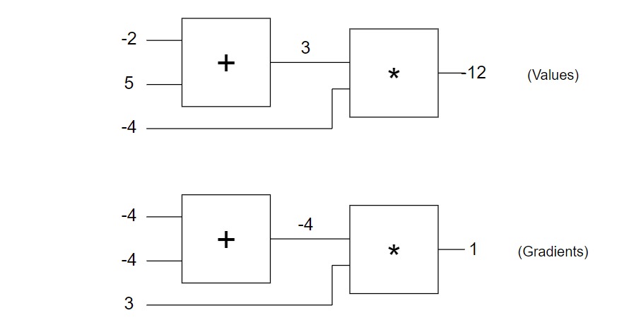

Q

Also note that we are using `+=` to add onto the gradient in the `backward` function. This will allow us to possibly use the output of one gate multiple times (think of it as a wire branching out), since it turns out that the gradients from these different branches just add up when computing the final gradient with respect to the circuit output. The other two gates are defined analogously

所以為甚麼要使用 += 算梯度，前面不都用 = 算 derivative

如果使用 += 那梯度不就不會沿著函數走了

而且這樣梯度不會越來越大嗎..

使用python打造一個小的pytorch的範例: [Hacker's guide to Neural Networks (karpathy.github.io)](http://karpathy.github.io/neuralnets/?fbclid=IwAR229GfWD95boQ8LweXhC7KY4jcQiYLGJ_25qdeG0NT1UGBD2nWpl3bPwjg)

A

chain rule就是反傳遞的原因

從後面傳回來，只要算一遍，像是下面這張圖

梯度一開始會歸0

下面的例子可以很好解釋為甚麼梯度是用加的

$$
\frac{\partial \sigma(x^2)}{\partial x} = 2x = x + x
$$

$$
\frac{\partial \sigma(xy)}{\partial x} = y
$$

因為資料間有相關性，所以梯度要相加